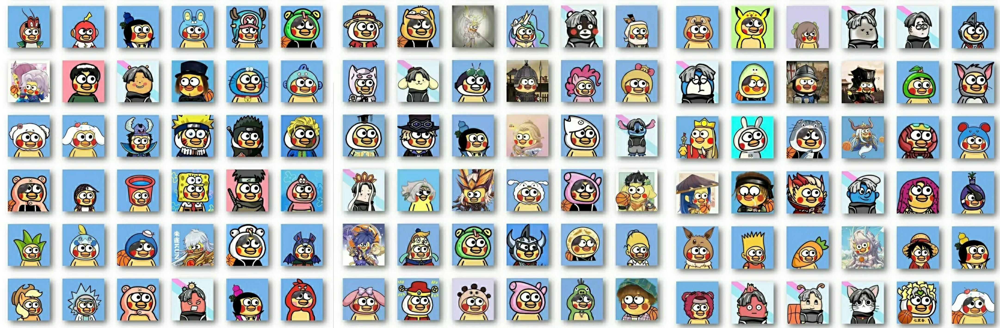
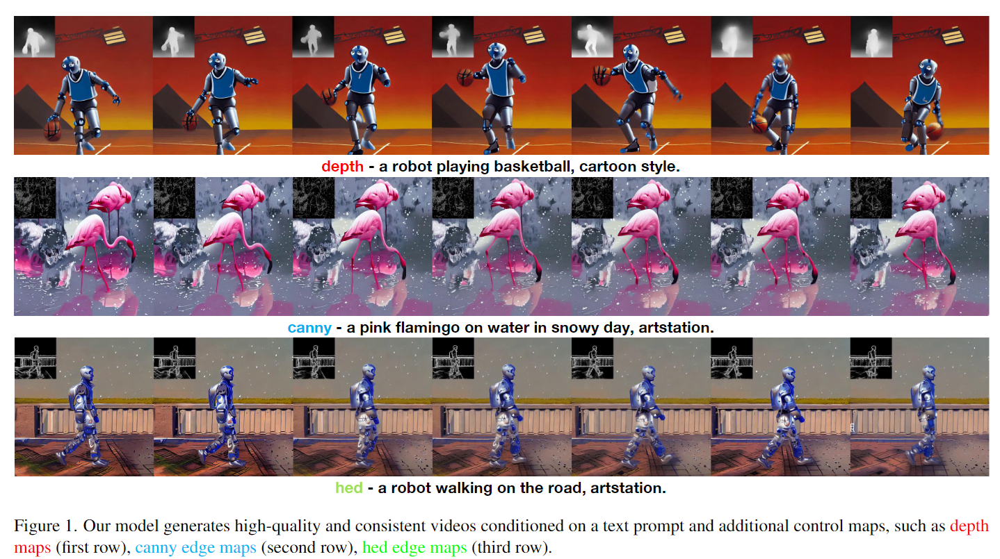
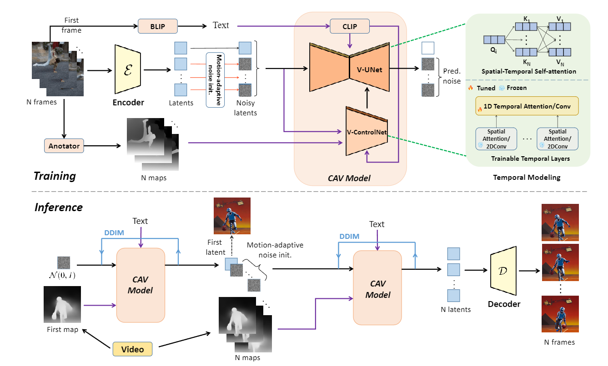
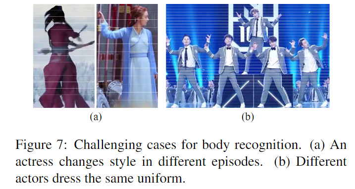
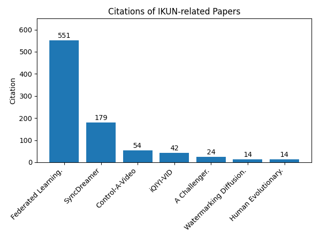
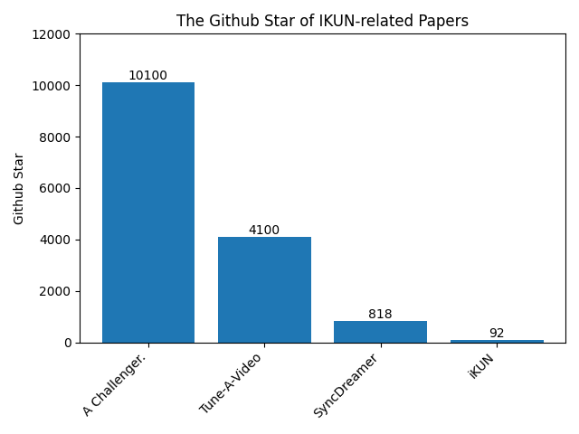
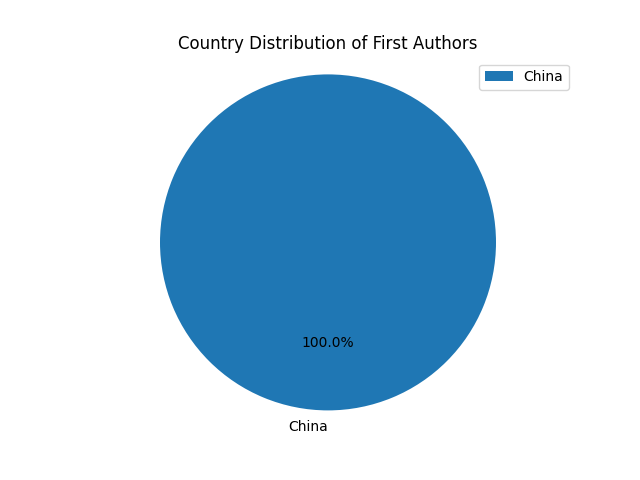
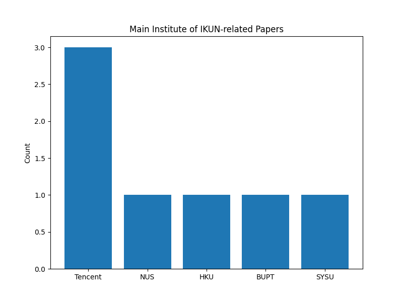

# Awesome CS IKUN

<p align="center">
  
</p>

<p align="center">
    【English   | <a href="readme/README_Chinese.md">中文</a>】
</p>


## 📖 Overview

- This is the first collection of academic iKUN papers in the world 🔥🔥🔥
- We have collected 4 KUNs of papers (1 KUN = 2.5) in Computer Science (CS)
- We hope to bring joy through this work and inspire new ways of promoting scientific research
- Your stars motivate us to keep updating, and we also welcome everyone to contribute awesome-cs-ikun via issues


## 🎉 News
* June 21, 2024, We release the awesome-cs-ikun repository

## 📑 Content
- [Awesome Papers](#-awesome-papers)
  - [Paper Details](#-paper-details)
  - [Paper List](#-paper-list)
- [Analysis](#-analysis)
- [Acknowledgments](#-acknowledgments)
- [Contact](#-contact)


## 🔥 Awesome Papers

### 🚀 Paper Details

#### [ICLR 2024] SyncDreamer: Generating Multiview-consistent Images from a Single-view Image
<p align="center">
  
</p>

#### [CVPR 2024] iKUN: Speak to Trackers without Retraining

<p align="center">
  
</p>

<p align="center">
  
</p>


#### [ESWA 2024] Human Evolutionary Optimization Algorithm
<p align="center">
  
</p>

#### [ICCV 2023] Tune-A-Video: One-Shot Tuning of Image Diffusion Models for Text-to-Video Generation
<p align="center">
  
</p>


#### [202312] A Challenger to GPT-4V? Early Explorations of Gemini in Visual Expertise

<p align="center">
  
</p>


#### [202310] You Only Train Once: A Unified Framework for Both Full-Reference and No-Reference Image Quality Assessment

<p align="center">
  
</p>

<p align="center">
  
</p>

<p align="center">
  
</p>

<p align="center">
  
</p>

<p align="center">
  
</p>


#### [202305] Control-A-Video: Controllable Text-to-Video Generation with Diffusion Models

<p align="center">
  
</p>

<p align="center">
  
</p>


#### [202305] Watermarking Diffusion Model

<p align="center">
  
</p>

<p align="center">
  
</p>


#### [202106] Federated Learning on Non-IID Data: A Survey
<p align="center">
  
</p>


#### [201811] iQIYI-VID: A Large Dataset for Multi-modal Person Identification

<p align="center">
  
</p>


### 📚 Paper List


 Title | Venue | Year | Code
---|------|------|---
[SyncDreamer: Generating Multiview-consistent Images from a Single-view Image](https://arxiv.org/pdf/2309.03453) | ICLR | 2024 | [Github](https://github.com/liuyuan-pal/SyncDreamer) 
[iKUN: Speak to Trackers without Retraining](https://arxiv.org/pdf/2312.16245) | CVPR | 2024 | [Github](https://github.com/dyhBUPT/iKUN) 
[Human Evolutionary Optimization Algorithm](https://www.sciencedirect.com/science/article/pii/S0957417423031408) | ESWA | 2024 | [Github](https://github.com/junbolian/HEOA) 
[Tune-A-Video: One-Shot Tuning of Image Diffusion Models for Text-to-Video Generation](https://arxiv.org/pdf/2212.11565) | ICCV | 2023 | [Github](https://github.com/showlab/Tune-A-Video) 
[A Challenger to GPT-4V? Early Explorations of Gemini in Visual Expertise](https://arxiv.org/pdf/2312.12436) | arXiv | 2023 | [Github](https://github.com/BradyFU/Awesome-Multimodal-Large-Language-Models) 
[You Only Train Once: A Unified Framework for Both Full-Reference and No-Reference Image Quality Assessment](https://arxiv.org/pdf/2310.09560) | arXiv | 2023 | [Github](https://github.com/BarCodeReader/YOTO) 
[Control-A-Video: Controllable Text-to-Video Generation with Diffusion Models](https://arxiv.org/pdf/2305.13840) | arXiv | 2023 | [Github](https://github.com/Weifeng-Chen/control-a-video) 
[Watermarking Diffusion Model](https://arxiv.org/pdf/2305.12502) | arXiv | 2023 | -
[Federated Learning on Non-IID Data: A Survey](https://arxiv.org/pdf/2106.06843) | Neurocomputing | 2021 | - 
[iQIYI-VID: A Large Dataset for Multi-modal Person Identification](https://arxiv.org/pdf/1811.07548) | arXiv | 2018 | -


## 📊 Analysis


### ✨ Citation

- We conducted a citation analysis of iKUN-related papers (as of June 21, 2024) and found that some of them have received significant citations
<p align="center">
  
</p>


### 🌟 Github Star

- We also conducted a GitHub star analysis of iKUN-related papers (as of June 21, 2024) and found that some papers have a high number of GitHub stars
<p align="center">
  
</p>


### 👨‍💻‍ Author Distribution

- We found that all first authors of iKUN-related papers are Chinese
<p align="center">
  
</p>

- The main institutions where the papers are published include Tencent, NUS, HKU, etc.
<p align="center">
  
</p>

- We believe that including ```kun kun``` in papers can bring more exposure to their research, thereby indirectly increasing their influence. This serves as an excellent example of how the entertainment industry can contribute to the promotion of the scientific community 🎉, bringing new inspiration to the way modern research is showcased 🎊

## 🤝 Acknowledgments

- Sincere thanks to all CS iKUN for including ```kun kun``` in your papers, you have pioneered a new way of idol-following 👍
## 📬 Contact

If you have any questions, feedback, or would like to get in touch, please feel free to reach out to us via email at [awesome_cs_ikun@163.com](mailto:awesome_cs_ikun@163.com)
