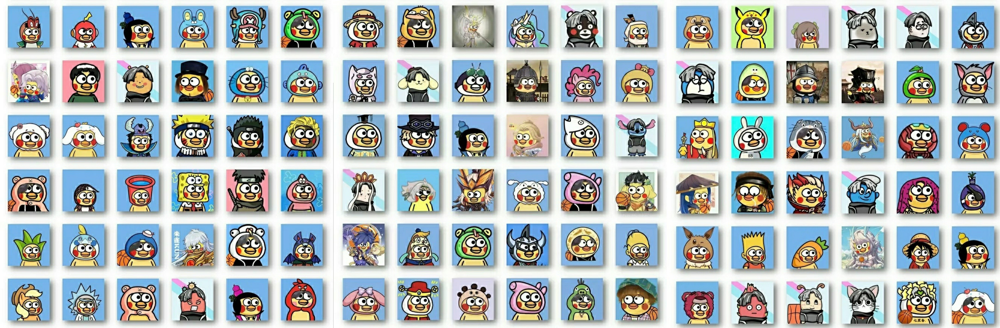
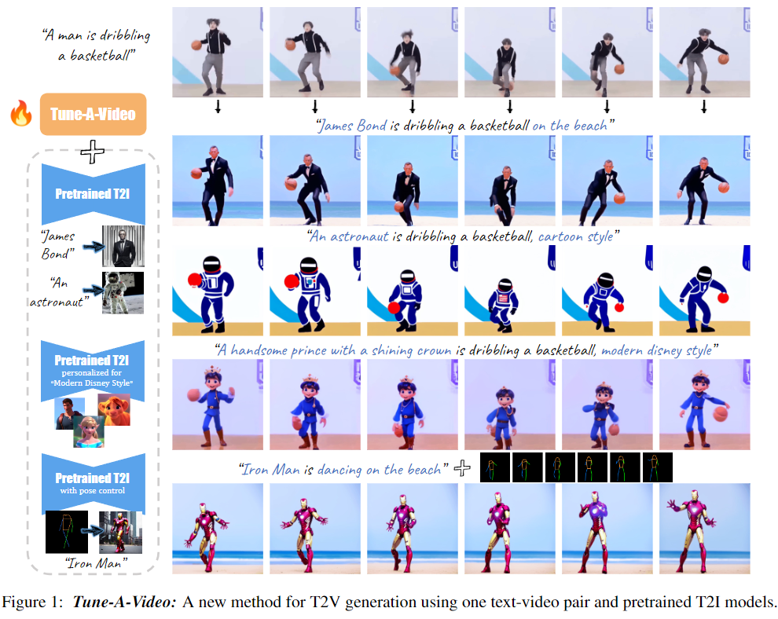
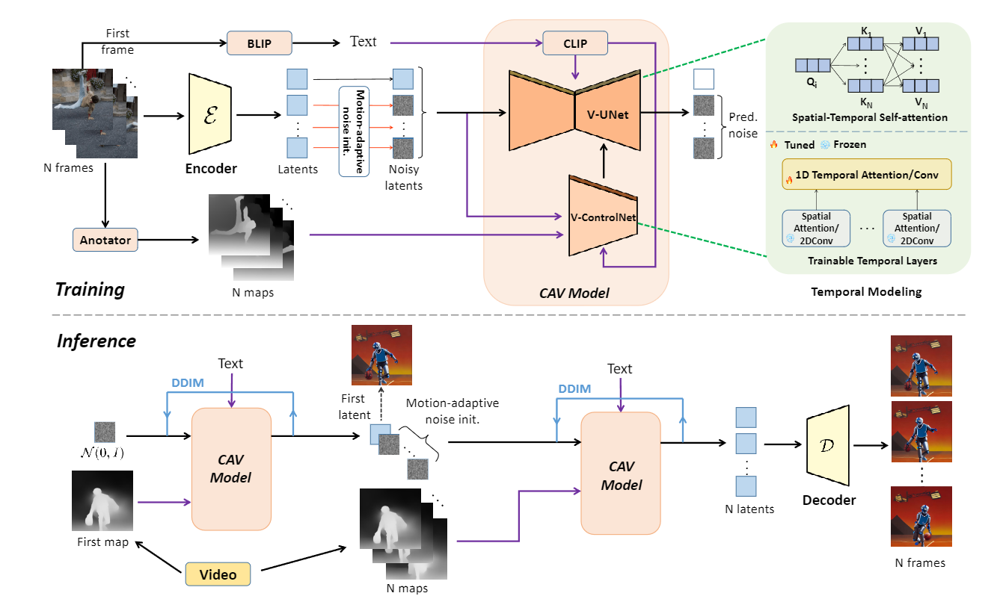
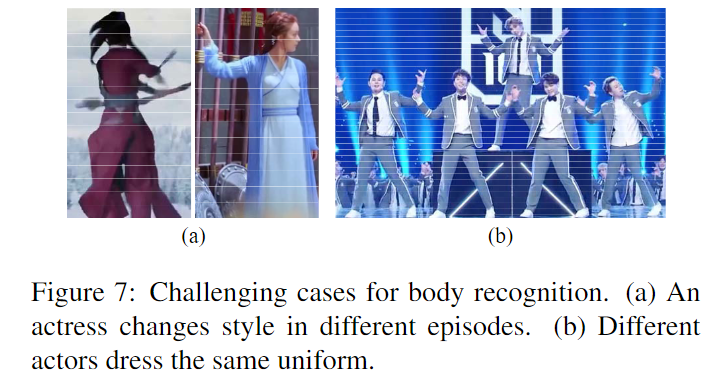
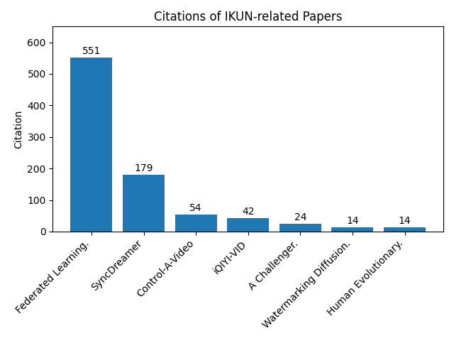
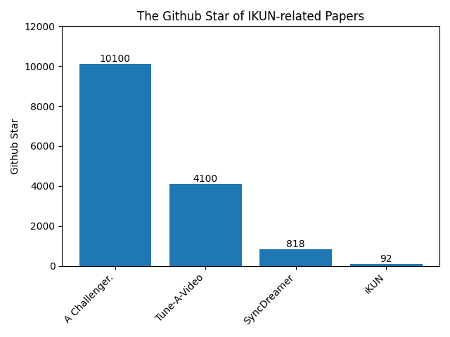
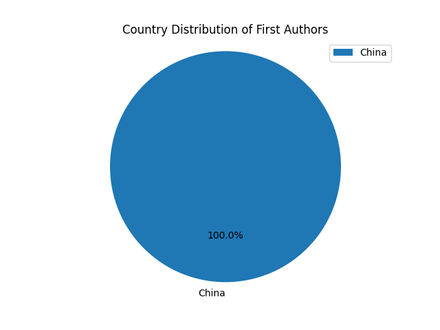
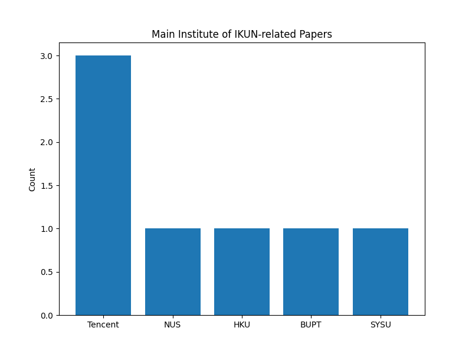

# Awesome CS IKUN

  

    【<a href="../README.md">English</a>   | 中文】

## 📖 概述

- 这是 **全球首个学术iKUN论文合集** 的GitHub仓库🔥🔥🔥
- 我们收集了4 KUN篇 (1 KUN = 2.5) 计算机iKUN论文，汇集了CS (Computer Science) iKUN近年来的主要工作
- 我们希望通过这个GitHub仓库：
  - 给各位科研人员繁忙的研究生活里添加些许乐趣
  - 对娱乐界促进科研界的发展带来一些思考与启发

- 您的Star是我们不断更新的动力，也欢迎大家在issue补充CS iKUN相关的论文
  
## 🎉 新闻
* 2024年6月21日，我们发布了全球首个学术iKUN论文合集 **Awesome CS IKUN**

## 📑 目录
- [iKUN论文合集](#-iKUN论文合集)
  - [论文详情](#-论文详情)
  - [论文列表](#-论文列表)
- [分析](#-分析)
- [致谢](#-致谢)
- [联系方式](#-联系方式)

## 🔥 iKUN论文合集

### 🚀 论文详情

#### [ICLR 2024] SyncDreamer: Generating Multiview-consistent Images from a Single-view Image

  

#### [CVPR 2024] iKUN: Speak to Trackers without Retraining

  

  

#### [ESWA 2024] Human Evolutionary Optimization Algorithm

  

#### [ICCV 2023] Tune-A-Video: One-Shot Tuning of Image Diffusion Models for Text-to-Video Generation

  

#### [202312] A Challenger to GPT-4V? Early Explorations of Gemini in Visual Expertise

  

#### [202310] You Only Train Once: A Unified Framework for Both Full-Reference and No-Reference Image Quality Assessment

  

  

  

  

  

#### [202305] Control-A-Video: Controllable Text-to-Video Generation with Diffusion Models

  

  

#### [202305] Watermarking Diffusion Model

  

  

#### [202106] Federated Learning on Non-IID Data: A Survey

  

#### [201811] iQIYI-VID: A Large Dataset for Multi-modal Person Identification

  

### 📚 论文列表

 标题 | 发布于 | 年份 | 代码
---|-----|----|---
[SyncDreamer: Generating Multiview-consistent Images from a Single-view Image](https://arxiv.org/pdf/2309.03453) | ICLR | 2024 | [Github](https://github.com/liuyuan-pal/SyncDreamer) 
[iKUN: Speak to Trackers without Retraining](https://arxiv.org/pdf/2312.16245) | CVPR | 2024 | [Github](https://github.com/dyhBUPT/iKUN) 
[Human Evolutionary Optimization Algorithm](https://www.sciencedirect.com/science/article/pii/S0957417423031408) | ESWA | 2024 | [Github](https://github.com/junbolian/HEOA) 
[Tune-A-Video: One-Shot Tuning of Image Diffusion Models for Text-to-Video Generation](https://arxiv.org/pdf/2212.11565) | ICCV | 2023 | [Github](https://github.com/showlab/Tune-A-Video) 
[A Challenger to GPT-4V? Early Explorations of Gemini in Visual Expertise](https://arxiv.org/pdf/2312.12436) | arXiv | 2023 | [Github](https://github.com/BradyFU/Awesome-Multimodal-Large-Language-Models) 
[You Only Train Once: A Unified Framework for Both Full-Reference and No-Reference Image Quality Assessment](https://arxiv.org/pdf/2310.09560) | arXiv | 2023 | [Github](https://github.com/BarCodeReader/YOTO) 
[Control-A-Video: Controllable Text-to-Video Generation with Diffusion Models](https://arxiv.org/pdf/2305.13840) | arXiv | 2023 | [Github](https://github.com/Weifeng-Chen/control-a-video) 
[Watermarking Diffusion Model](https://arxiv.org/pdf/2305.12502) | arXiv | 2023 | -
[Federated Learning on Non-IID Data: A Survey](https://arxiv.org/pdf/2106.06843) | Neurocomputing | 2021 | - 
[iQIYI-VID: A Large Dataset for Multi-modal Person Identification](https://arxiv.org/pdf/1811.07548) | arXiv | 2018 | -

- 论文都给哥哥整理好了，方便哥哥一网打尽，开庭时带上你的论文🥳

## 📊 分析

### ✨ 引用量

- 我们统计了部分iKUN相关论文的引用量（时间截至20240621），发现部分论文有着较高的引用量

  

### 🌟 Github Star

- 我们还统计了iKUN相关论文对应代码仓库的Star数量（时间截至20240621），发现部分论文也有着较高的Star数量

  

### 👨‍💻‍ 作者分布

- 我们发现iKUN相关论文的第一作者100%是华人

  

- 论文发布的主要机构包括腾讯、新国立、港大等

  

- 我们认为将哥哥写进论文可以带来更多的论文曝光度，进而间接地增加了论文的影响力。这是娱乐界对科研界起到促进作用的一个很好的示范🎉为现代科研成果展示的方式带来了新的启发🎊

## 🤝 致谢

- 真诚感谢各位CS真iKUN能把哥哥写进论文里，是你们开辟了追星的新方式👍

## 📬 联系方式

- 如果您有任何问题、反馈意见或想要联系我们，欢迎随时通过电子邮件与我们联系： [awesome_cs_ikun@163.com](mailto:awesome_cs_ikun@163.com)
